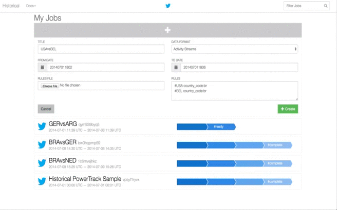

# Overview

A simple Rails application that uses the [Gnip Historical PowerTrack API](http://support.gnip.com/apis/historical_api/)
to give you complete and comprehensive access to every publicly available Tweet, ever.

Here's a short video showing how to get Twitter data about the 2014 World Cup matches:

# Features

* Create, estimate, accept and download Historical jobs
* Detailed job progress
* Filter jobs based on ID, Title, Date or Status
* Supports IE10+, FF, Chrome, Opera 12+, Safari 5+
* _NOTE_: If your expected dataset is large (over 1GB), we recommend you use a more efficient tool to parallelize file downloads

# Requirements

1. A [Gnip Account](http://gnip.com) with a Historical PowerTrack Subscription
2. [Ruby 2.0.x](http://www.ruby-lang.org).
3. [Ruby on Rails 4.0.x](http://rubyonrails.org).
4. You may need Python on your `PATH` to install some dependencies on Windows

# Setup

Open a terminal window and execute the following commands:

    git clone git://github.com/twitterdev/historical-api-rails-demo.git
    cd historical-api-rails-demo

Ensure the following environment variables are set:

* GNIP_ACCOUNT = Your Gnip account.
* GNIP_USERNAME = Your Gnip username.
* GNIP_PASSWORD = Your Gnip password.

# Usage

To run, execute `bundle install` and then `rails s`.

# Testing

To test, do the following:

1. Ruby Specs: `rake spec`
2. JavaScript Specs: `rake spec:javascript`
3. Both: `rake test`

NOTE: `guard` will automatically run RSpec, and CoffeeScript (sorry, no auto-jasmine yet).

# Contributions

Read CONTRIBUTING for details.

# Credits

* [Eric Wendelin](https://github.com/eriwen)
